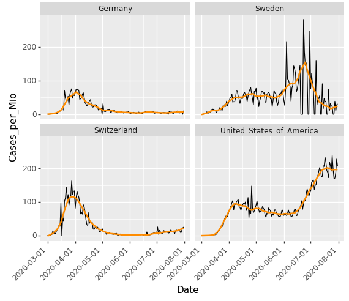

# COVID-19 Cases per Mio

The short scripts `r/cases_per_mio.R` and `py/cases_per_mio.ipynb`

1. download data from [European Centre for Disease Prevention and Control](https://www.ecdc.europa.eu/en),

2. select a couple of countries and do the necessary transformations, and

3. plots the cases per mio inhabitants including a scatter plot smoother.

The resulting plot of the Python script as per July 31, 2020:

